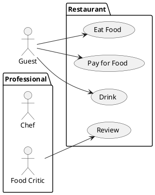

# Especificação dos Requisitos do SITCC

## Requisitos Funcionais

### Lista de Requisitos Funcionais

- RF01 - Inserir TCC
- RF02 - Remover TCC

### Diagrama de Casos de Uso

### Especificicações de Casos de Uso

[reqs_UC01.md]

## Requisitos não-funcionais

### Usabilidade

... Segundo ... Nilsen ...

## Referências

[1] Nilsen ...

[2] Ian Somerville ...

[3] Angular ...

[4] PlantUML ...

